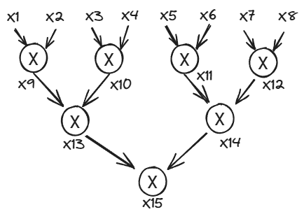

# Session 1 : 19 June 2024

## Recap 

In general any PIOP can be used with any PCS. Caveat: Some PIOPs use univariate polynomials, others use mulitlinear. The commitment scheme chosen must support the same kind of polynomial.

In general multilinear leads to reduced prover cost while univariate leads to reduced verifier cost.

Comment on front end constraints can be gereneralized to [CCS](https://eprint.iacr.org/2023/552)

## Summary

This sesssion content will be first an explanation of a PIOP so we can understand how it works and then the main part, a discussion of costs of operations in these schemes.

## Example PIOP

Prover knows a wittness

$$
w = \displaystyle\prod_{i=1}^8 x_i
$$

let <strong>g</strong> be a univariate polynomial with degree 14 such that for i = 1 to 15

$$
g(i) = x_i
$$

<strong>g</strong> is a low degree extension of the circuit values

g encodes the constraints

    ### gate constraints

    - for every mult gate 9 to 15 g(j) = g(inL(j)) * g(inR(j)) or for each g(j) -() g(inL(j)) * g(inR(j)) = 0
    ### IO consistency constraints

    - for inputs 1= 1 to 8 g(i) = xi
    - for i = 15 g(i) = w

focusing on t gate constraints the idea oc 

So now to explain PIOP (for univariate case)

- prover sends g
- prover sends q
- V wants to check that h(x) = q(x)*Z_s(x)
  - pick r at random
  - check that h(r) = q(r)*Z_s(r)

## Costs for Prover

- Commit to Polynomials
  - Groups
    - Com(q) is usually a multi exponentiation (aka multi scalar multiplication) over the co-efficient vector
    - usually teh commitement com(q) is one group element.
  - Hashing
- For sumcheck lots of field operations
- P computes evaluation proofs

### handwavy hiding commitement (group based liek KZG or bulletproof)

pick g as randome from teh group

g1^c^1 , g2^c^2, g3^c^3 ...g4^c^n

can use powers of Tau so $g_n = g^{\tau^n}$

and then combine
$$
Com(q) = \displaystyle\prod_{i=0}^{n-1} g_i^{c_i}
$$

### handwavy hiding commitment in the hash case (FRI, Binius, Breakdown)

Treat the co-efficents as a vector $\vec{v} = \begin{pmatrix} c_1&c_2&c_3& ... & c_{n-1}\end{pmatrix}$. Encoded it with an error correcting code. and the committment is a merkle hash of the encoding.

so the main operations being done are msm's, hashing (encoding) and field ops

### Field ops

For big fields e.g. 256 bit. We use [montgomery multiplication](https://hackmd.io/@drouyang/msm), field element e typcially stored as e*r (r is choosen to make wrap around easier to compute) remember we are doing modulo arithemitic so a.b = q.p + r where r is the answer.
Addition is much cheaper than multiplication. (this is where the treat as free comes from). Guideline 40 cycles for mult, 7 for add

For 31 or 64 bit fields teh costs are lower ... guideline 6 cycles for mult and 1-3 cycles for addition. Use carefully chosen fields like babybear ($2^{64}−2^{32} + 1$)

Modern CPU vectorization can change the math here.

### MSMs

Naievly n group ops * n group exponentiations (each of which is lots of group ops). use [Pippenger algorithm](https://hackmd.io/@drouyang/msm) wich gives log n factor improvement (typical may be 20 or 30 factor)

Recent PIOPs allow the Prover to commit to 'small' values. Can get as low as one group op per commited value.

### Pairings

Usually done by the verifier. These can be expensive e.g. 1000 group oparations. e.g. verifier cost for zeromorph $= log(n)$ group ops  and $3$ pairings

### FFT

$n/2$ for field mults and $log_2(n)$ for field adds but if n is big ($n>2^{14}$) can become memory bound.

### Hashing

Not directly related to field ops (can micro-benchmark it) unless we are using a SNARK Friendly Hash (e.g. poseiden)

## Next Session

Move to Chapter 2 of the book.

## Reference

- [zkcalc]
- [Session with Notes](https://youtu.be/kaFpq3oPncA?si=zqD314Nn4ELthPi2)
