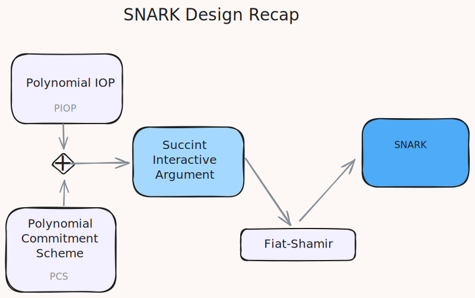

# Session 1 : 19 June 2024

## Recap 

In general any PIOP can be used with any PCS. Caveat: Some PIOPs use univariate polynomials, others use mulitlinear. The commitment scheme chosen must support the same kind of polynomial.

In general multilinear leads to reduced prover cost while univariate leads to reduced verifier cost.

## Summary

This sesssion content will be first an explanation of a PIOP so we can understand how it works and then the main part, a discussion of costs of operations in these schemes.

### Prelim Discussion on Front ends - R1CS, Plonkish, and AIR

Can be gereneralized to [CCS](https://eprint.iacr.org/2023/552)

## Reference

- [Session with Notes](https://youtu.be/kaFpq3oPncA?si=zqD314Nn4ELthPi2)
